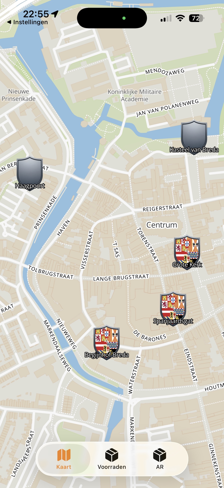
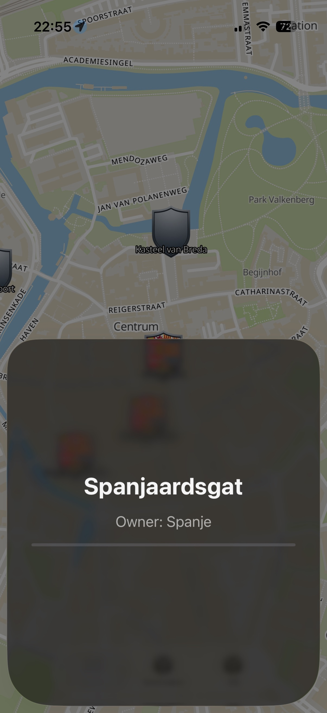

# HiStory MVP
Ontdek historische locaties op een interactieve kaart met aangepaste iconen, gebouwd met MapLibre.

## Over het project
HiStory is een Minimum Viable Product (MVP) waarmee gebruikers historische locaties kunnen verkennen op een interactieve kaart. 
Elke locatie wordt weergegeven met een aangepast icoon dat direct inzicht geeft in van welke partij de locatie is.

Het doel van dit MVP is om snel te valideren of gebruikers interesse hebben in het ontdekken van geschiedenis op basis van locatie.

## Features
- Interactieve kaartweergave met MapLibre
- Historische locaties weergegeven als markers
- Ondersteuning voor custom iconen
- In- en uitzoomen
- Responsive ontwerp voor desktop en mobiel
- Open-source kaarttechnologie zonder vendor lock-in

## Screenshots

## Technische Stack
- Swift
- MapLibre

## Waarom MapLibre?
HiStory maakt gebruik van MapLibre GL JS vanwege:

- Open-source licentie
- Geen afhankelijkheid van commerciële kaartproviders
- Hoge prestaties dankzij WebGL
- Compatibiliteit met vector tiles
- Actieve community

x WorldwideErrors // Jeffrey
